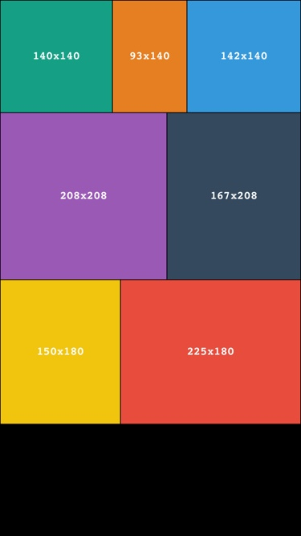

# Lay
A library to compute a perfectly balanced collection of CGSize elements for a specified width.

This project is heavily inspired by [this article](https://medium.com/@jtreitz/the-algorithm-for-a-perfectly-balanced-photo-gallery-914c94a5d8af#.ac11ixwdn) written by [Johannes Treitz](https://medium.com/@jtreitz).



## Usage

```swift
import Lay

let sizes: [CGSize] = [
	.init(width: 100, height: 100),
	.init(width: 80, height: 120),
	.init(width: 100, height: 100),
	.init(width: 200, height: 200),
	.init(width: 80, height: 100),
	.init(width: 100, height: 120),
	.init(width: 100, height: 80)
].lay_calculate(for: view.bounds.size.width)

print(sizes)

>>> [(140.0, 140.0), (93.0, 140.0), (142.0, 140.0), (208.0, 208.0), (167.0, 208.0), (150.0, 180.0), (225.0, 180.0)]
```

Checkout out the Example app to see how this can be integrated with `UICollectionViews`.

## Requirements

- Xcode 8.0+
- iOS 8.0+
- Swift 3.0+

## Installation

### Carthage

For [Carthage](https://github.com/Carthage/Carthage), add the following to your `Cartfile`:

```ogdl
github "min/Lay" ~> 0.1.0
```
